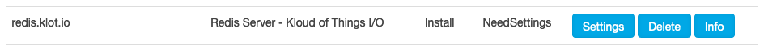
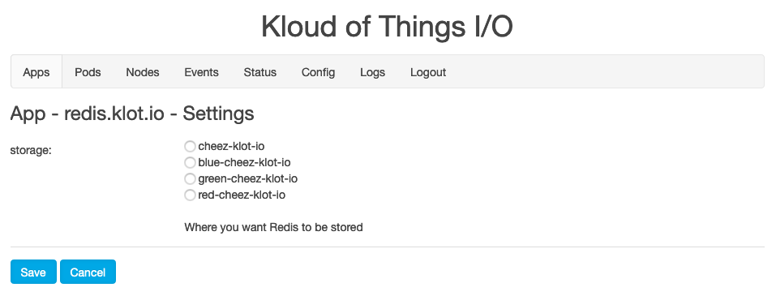
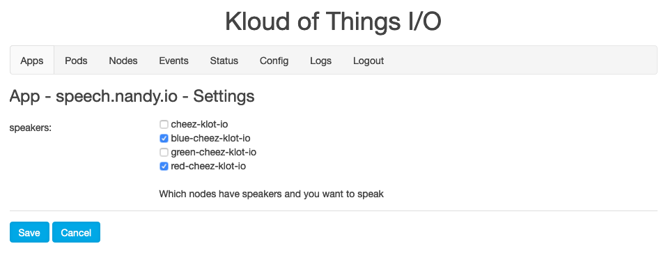
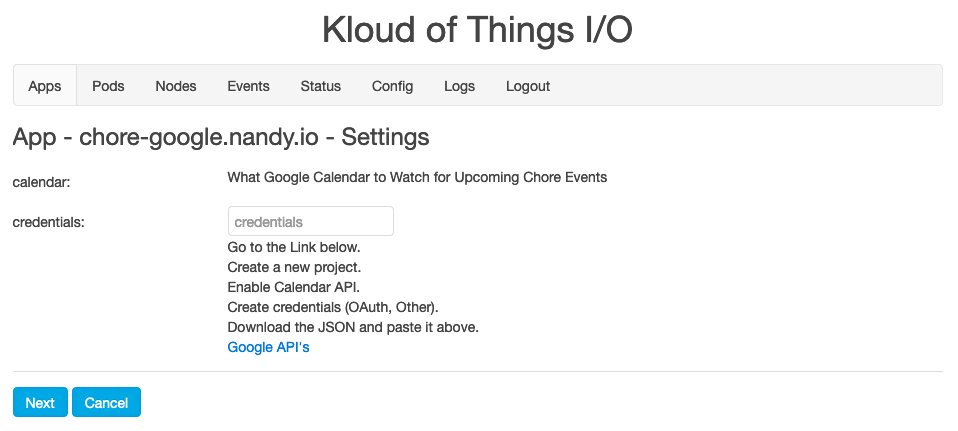

# Apps! Apps! Apps!

Make sure you have a Master node and a Worker or two before installing Apps. Head back to [Install](Install.md) for how. Else hit up the Apps page on your Master.

A bunch of Apps come pre downloaded.  What this means is you can just click Install and they'll be installed on your cluster.

## Settings

Some Apps require Setttings.  If this is the case, it'll let you know after you try to install with the Status of NeedSettings.

Just click on the Settings button to give the App what it needs.

NOTE: For some reason saving settings involving Nodes sometimes throws an error. Just click Sace or Next again and it should work.

### Node

In some cases, it's for consistency.  With Redis or MySQL, it needs to keep data on a particular Node. So if a part of the App suddenly dies, it'll come back on the same Node with that data still there.

Just select the Node you want (I usually create a special node with a  for this) and click Save.

### Nodes

In others cases, it's so the App knows which Nodes have special equipment attached, like speakers for Nandy Speech.

Just select all the Nodes you want and click Save.

### Advanced

Finally, some Apps need to know how to connect to things like Google Calendar. This is a multi step process and we'll have you go back and forth with Google Apps, create your project, enable Nandy's acccess to it, etc.  Ya, it's a pain of a pain, but the end result is only your personal Klot I/O cluster has access to your stuff.  There's no way I personally I can create surprise ice cream parties for uninvited guests on your Calendar (and I totally would).

In these cases, follow the instructions, input what's asked, click Next when prompted, and when everything is all set, click the Save button.  Don't worry about whether to click Next or Save, only one will be there at a time.

### Under the Hood

For you Kubernetes savy folks, these Settings are creating ConfigMaps, which are acessed by the Apps for what it needs.

For you Kubernetes really savy folks, the Node Settings are labeling Nodes through traditional Kubernetes. It'll prefix the actual labels with the app name. So `storage` is really `redis.klot.io/storage` and 'speakers' is really `speech.nandy.io/speakers`.  With `storge` it's using a NodeSelector for a Deployment, so the Pod sticks to that Node.  With `speakers` it's using a NodeSelector for a DaemonSet, so Pod is created on each Node that needs to utilize the speakers.

## Pending

Once everything is set, Klot I/O will resume the installation of the App. Understand this can take awhile as, Klot I/O needs to download Docker images.

This is indicated as a status of Installing.  You can also head over to Pods and see which ones are Pending to get an idea of where everyting is at.

## Example

Let's install Nandy Speech as an example

- Make sure you have speakers hooked up to a Node
- Go to your Apps page
- Click Install next to Nandy Speech
- When Speech's Status becomes NeedSettings, click Settings
  - Select the Node that has speakers hooked up to it
  - Click Save
- Note Redis is starting to Install too (Nandy Speech needs it)
- When Redis's Status becomes NeedSettings, click Settings
  - Select a Node you want Redis to run on (whatever, your preference)
  - Click Save
- Wait for Speech's status to be Installed
  - Get a sammich (takes a while)
- Once Speech is Install click the Open button
  - Click the speech-nandy-io namespace to focus on the Pods we care about
- Type something (preferably inappropriate) into the form and listen to your own shenanigans.

## Great Success

Congrats! You now have Nandy Speech (and a Redis server) running in your home cluster!

Yep, that's a URL on your local network based on the App and Service name. For you Kubernetes savy folks, yes nginx serving the site on each node also acts as a distributed Ingress controller using LoadBalancer Service definitions. For anyone wondering how the hell the DNS is working, we're using that same Service to register CNAMES through avahi / mDNS.  Neat huh?

Also notice Klot I/O has a Home page in the header. This has all your installed Apps that have URL's. Once installed, you can use that as a landing page for a phone or tablet and access your Apps directly.  Also, that Home page has become the landing page for <cluster>-klot-io.local.

## Uzbeki Blues

If you're on an Android tablet or phone, accessing Klot I/O probably won't work, not even the Apps' fancy local URL's. We're using mDNS here and it's not supported on Android in some cases.

Fortunately, we have a way around it, if you're down with some network settings.

- Figure out the IP of your Master node and maybe one Worker Node
  - You should have already locked that in setting everything up
- Go into your device's network DNS settings
- Replace the DNS servers with the IP for your Master node

NOTE: You best keep your Master Node and Worker Node running for that device to work properly during setup, whether you're using Klot I/O or not.

That's because the Master node of Klot I/O acts as a DNS server, serving our special mDNS records through regualr DNS, and passing everything else through to whatever the Pi is using for DNS. So while your errant devices can't use mDNS, we can fake them out a little with some mini DNS (Don't look up that term - I just made it up).

## The Legends Continue...

Here's a list of all the Apps with their current statuses:
- green - ready to go with good docs
- blue - ready to go with bad or no docs
- yellow - barely remember how it works
- red - vaporware

| name | status | description |
| ---- | ------ | ----------- |
| [redis.klot.io](https://github.com/klot-io/redis) | blue | Redis server |
| [mysql.klot.io](https://github.com/klot-io/mysql) | blue | MySQL server |
| [speech.nandy.io](https://github.com/nandy-io/speech) | blue | Text to Speech on the Pi's |
| [chore.nandy.io](https://github.com/nandy-io/chore) | blue | Chores for the kiddos (and adults) |
| [button.nandy.io](https://github.com/nandy-io/button) | blue | Responds to buttons pushed on the Pi's |
| [chore-speech.nandy.io](https://github.com/nandy-io/chore-speech) | blue | Chore to Speech integration (yells at the kiddos) |
| [chore-button.nandy.io](https://github.com/nandy-io/chore-button) | blue | Chore to Button integration (kiddos push a button to complete a task) |
| [chore-google.nandy.io](https://github.com/nandy-io/chore-google) | blue | Chore to Google Calendar integration for scheduling |
| [chore-slack.nandy.io](https://github.com/nandy-io/chore-slack) | blue | Chore to Slack integration for notification |
| [share.nandy.io](https://github.com/nandy-io/share) | red | Account for time and money in the household (read: allowance) |
| [chore-share.nandy.io](https://github.com/nandy-io/chore-share) | red | Chore to Share integration (reward the kiddos / game the system) |
| [graphite.klot.io](https://github.com/klot-io/graphite) | red | Graphite server |
| [chore-graphite.nandy.io](https://github.com/nandy-io/chore-graphite) | red | Chore to Graphite integration, long term metrics |
| [share-graphite.nandy.io](https://github.com/nandy-io/share-graphite) | red | Share to Graphite integration, long term metrics |
| [grafana.klot.io](https://github.com/klot-io/grafana) | red | Grafana server |
| [chore-grafana.nandy.io](https://github.com/nandy-io/chore-grafana) | red | Chore to Grafana integration, data visualization |
| [share-grafana.nandy.io](https://github.com/nandy-io/share-grafana) | red | Share to Grafana integration, data visualization |
