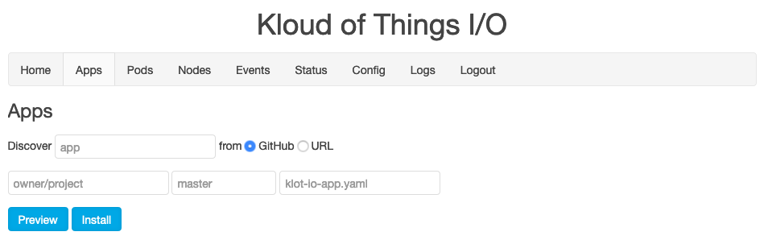
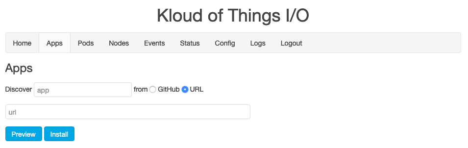

# Apps

An App is just Custom Resource Definition in Kuberenetes I created for Klot I/O. Adding an App for Download is literally just creating a resource, like making Namespace or Pod.

Here's the general redis.klot.io App:

```yaml
apiVersion: klot.io/v1
kind: KlotIOApp
metadata:
  name: redis.klot.io
spec:
  namespace: redis-klot-io
  description: Redis Server - Kloud of Things I/O
  manifests:
  - path: kubernetes/namespace.yaml
  - path: kubernetes/db.yaml
  settings:
  - name: storage
    description: Where you want Redis to be stored
    node: enabled
```

## Basics

apiVersion and kind are standard.  The metadata.name should be domain like.  The metadata.description should explain what it is.

### spec.namespace

The namespace your app will use. Right now, we assume one namespace per App. I have a feeling this may go away at some point.

### spec.manifests

Manifests are the resources to be created when your App is installed.

Paths in this repo for manifests to apply to Kubernetes in this order.

### spec.settings

Settings are optional, used to ensure special services end up on the appropriate nodes or to set access to things like Google Calendar.

For example, redis.klot.io by default saves to disk.  So if a Redis Pod dies you want it to come back with that data from disk.

Normally Pods can be created on any node, so to ensure consistency redis.klot.io requires that it's only installed on the node labeled as such:

The means a Kubernetes node has to be labeled `redis.klot.io/storage=enabled` for redis.klot.io to be installed on it.

You can see this in the `Deployment` in `kubernetes/db.yaml`


First, with `volumes` and `volumeMounts` we're having `/home/pi/storage/redis.klot.io` on the host machine map to `/var/lib/redis` in the Pod. If the Pod goes away and comes back, it's data will still be there.

Second, with `nodeSelector` we're saying only this on nodes labeled with `redis.klot.io/storage=enabled`

Third, with `tolerations` we're saying this can tolerate the `NoSchedule` taint on the master.

## Requires

Requires allows you to specify what other Apps this one requires. We can see this in the speech.nandy.io App:

```yaml
apiVersion: klot.io/v1
kind: KlotIOApp
metadata:
  name: speech.nandy.io
spec:
  namespace: speech-nandy-io
  description: Speech - Nandy I/O
  manifests:
  - path: kubernetes/namespace.yaml
  - path: daemon/kubernetes/daemon.yaml
  - path: api/kubernetes/api.yaml
  - path: gui/kubernetes/gui.yaml
  settings:
  - name: speakers
    description: Which nodes have speakers and you want to speak
    multi: true
    node: enabled
  requires:
  - name: redis.klot.io
    source:
      site: github.com
      repo: klot-io/redis
  url:
    protocol: http
    host: www-speech-nandy-io
```

### spec.requires

Array of requirements, containing a name and source.

### spec.requires.name

The name of the App.  Match match what's found at source.

### spec.requires.source

The source of the App.  You can specific this as a URL or as a GitHub repo.

### spec.requires.source.repo

Set to the repo to use.  Assumes there's a `klot-io-app.yaml` at the top level of the repo.

### spec.requires.source.url (alternative)

The URL at which you can find the App definition file.  If ending in /, will assume `klot-io-app.yaml`.

## URL

You can specify a URL to serve as a landing page for your App. We can see this in the speech.nandy.io App:

### spec.url

The URL to use as a landing page

### spec.url.protocol

Protocol to use, http/https currently.

### spec.url.host

Host to use. It'll build the URL as protocol://host-cluster-klot-io.local

## Download

Once you have your own App done, go the Apps page and hav eyour cluster Discover it.

If you have your App in the GitHub repo like the apps here, select the GitHub option.



Alernatively, you can give a URL, of which the manifests must be in sub directories.



Click Preview to view the App file.  Click Install to get it started (in here).

# kubectl

This assumes you have a Mac.  I will eventually verify this works on Linux or modify til it does.  Same with Windows.

kubectl is the command line tool for interacting with Kuberentes.  While the [GUI](GUI.md) is great and makes lots of things easier, you really should become familiar with kubectl if you want to improve your Kubernetes game.

- Check out this repo and set up a cluster via [Install](Install.md)
- Type `make kubectl`
  - This will install kubectl if you don't already have it
- It'll ask you for the cluster and password.
  - Use the name of the cluster you configured the Master with
- It'll create a context for this cluster (cluster-klot-io).
- If you have an existing `~/.kube/config` it'll merge else it'll just create a new ~/.kube/config file.

You can see if it worked by checking nodes:

```
kubectl get nodes
```

From here, you best check out [Kubernetes](https://kubernetes.io/docs/tutorials/) understanding that you've already created a cluster. You will be able do things like deploying an App manually.

# Services

If you want to hack on the different [Services](http://www.klot.io/#/overview), you can modify them right here and update your local cluster with them.

- First setup your cluster `make cluster`
- It'll ask you for the cluster and password.
  - Use the name of the cluster you configured the Master with
- Enter the worker nodes one by one
- It'll create local information to use later

Like now.  To update all the services across your cluster:

- Type `make update`
- It'll ask you for the cluster and password.
  - Use the name of the cluster you configured the Master with
- What the scroll do the updating

If something goes wrong, you can check the logs via the GUI.

If something goes really wrong, ssh to a node (usually the master) and use the following commands to view the logs of the different services:

```
sudo journalctl -u klot-io-dns    # DNS
sudo journalctl -u klot-io-daemon # Daemon
sudo journalctl -u klot-io-api    # API
sudo journalctl -u nginx          # GUI
```

## GUI

The GUI is located in the [www/](www/) directory here.  It's a [doTRoute.js](http://gaf3.github.io/dotroute/) JavaScript one pager.  Haven't heard of doTRoute.js?  Ya, that's because I created and usually don't bother with any self promotion.

The main files you care about are the *.html which utilize [doT.js](http://olado.github.io/doT/) templating and the controller is (service.js)[www/js/service.js].

## API

The API is [lib/manage.py](lib/manage.py). It's a regular ol' [Flask App](https://flask.palletsprojects.com/en/1.1.x/).

## Daemon

The Daemon is at [lib/config.py](lib/config.py). It's a basic Python Daemon that reads config files from on the Pi and implements those settings. It also does a little auto discovery magic that times a little time so the API can respond snappily.

## DNS

The DNS server is at [lib/name.py](lib/name.py). It's a simple name server that queries Kuberentes and responds to service names accordingly, passing the rest through to the RPi's nameserver in `/etc/resolv.conf`.

# Console

I use this to make the images.

## requirements

- A cable like [these](https://www.amazon.com/gp/product/B07554Z4LX/ref=ppx_yo_dt_b_search_asin_title?ie=UTF8&psc=1)
- Drivers for the [Mac](http://www.prolific.com.tw/us/showproduct.aspx?p_id=229&pcid=41)

Once installed:

```bash
screen -S pi /dev/cu.usbserial 115200
# To exit, ctrl-a, :quit and then unplug the cable
```

Can leave console going through multiple reboots of the Pi.

To disconnect, ctrl-a, :quit, and then unplugged the cable from the Mac.  Not doing this may require a hard reboot of the Mac.

# Image

If you want ot make your own image, go right ahead.

## requirements

- This assumes you're using a Mac.
- You're on the same network as the Pi will be
- Console set up (above)
- docker
- docker-compose

## base image

On Mac:

```
# Burn the latest lite raspbian image (2020-02-13-raspbian-buster-lite.zip currently) first then, pop it out and back in, then
make build
make boot
```

Eject, pop into Pi, connect serial cable, power on, and create a console.

## enable wifi

This is only needed so that the Pi can download.  You don't need to do this step if you're using the the wired ethernet port.

Login when prompted (pi/raspberry)

```
cd /boot/klot-io/bin
./wifi.sh
```

Answer questions for ssid and psk.

Will reboot when done.

## install klot-io services

```
cd /boot/klot-io/bin
./klot-io.sh
```

Will install and run the config daemon and then tails its logs to make sure it's working.

The daemon sets hostname to klot-io, change pi password to 'kloudofthings', and reset network to eth0 (if needed)

## enable tmpfs (optional)

This will extend the SD card's life but I don't do it anymore as I think it causes all sorts of other problems.

```
./tmpfs.sh
```

## export image to Mac

Shutdown the Pi.

```
sudo shutdown now
```

Eject the card, place into the Mac.

```
make export
```

This will copy the SD image to the images/ directory as pi-(version>).img with (verison) from the Makefile. Fair warning, this takes forever.

## shrink image to more manageable size

```
make shrink
```

## zip the image up

```
make zip
```

This will shrink down images/pi-(version>).img to a more manageable size.
