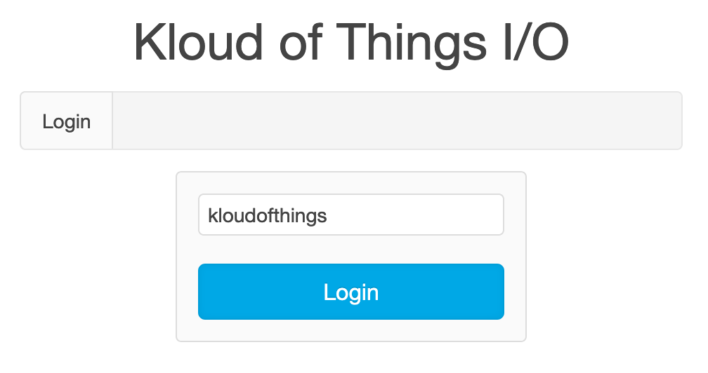
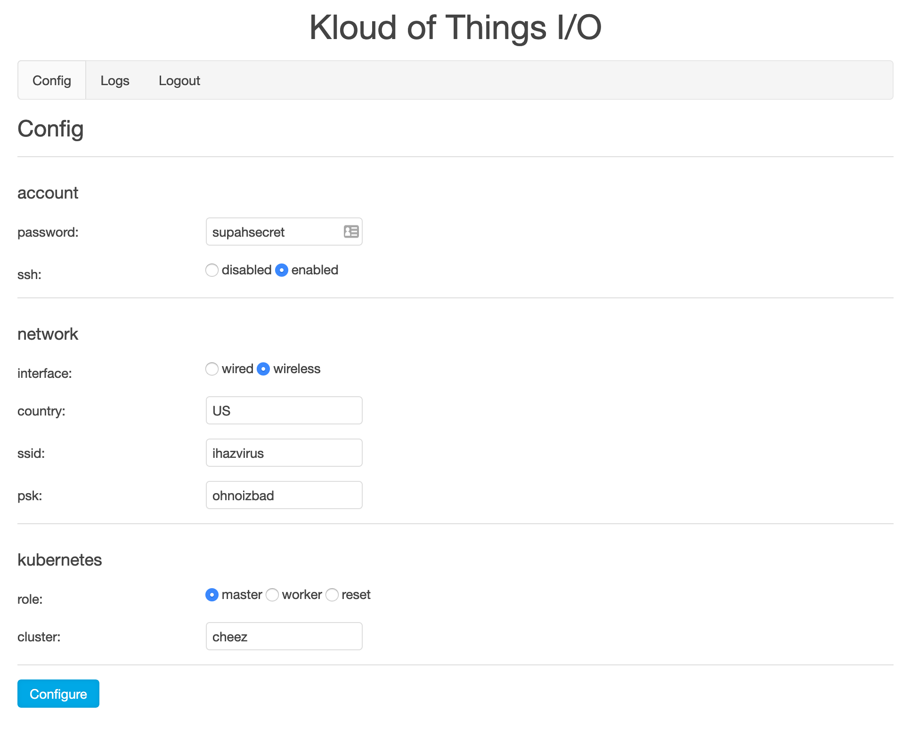
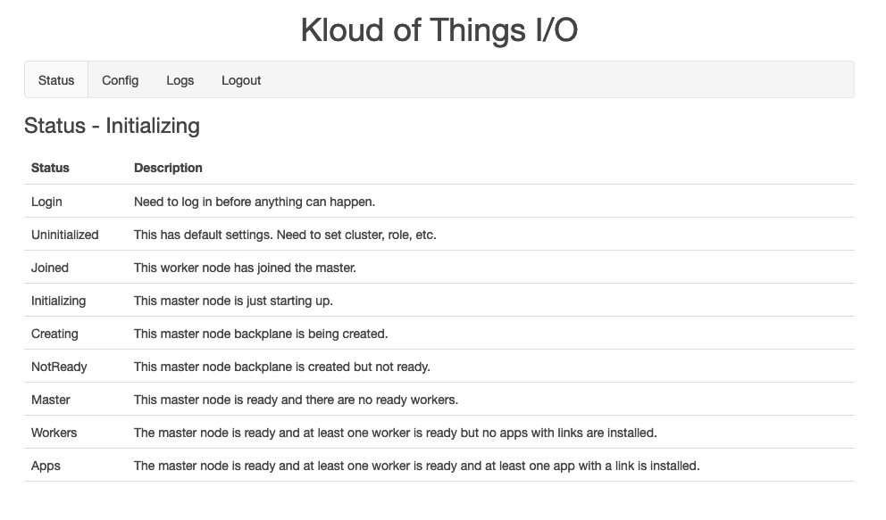
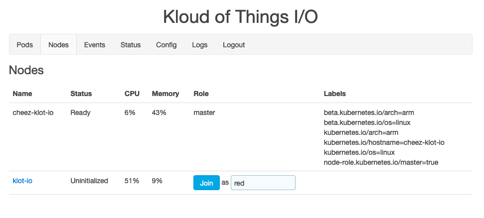
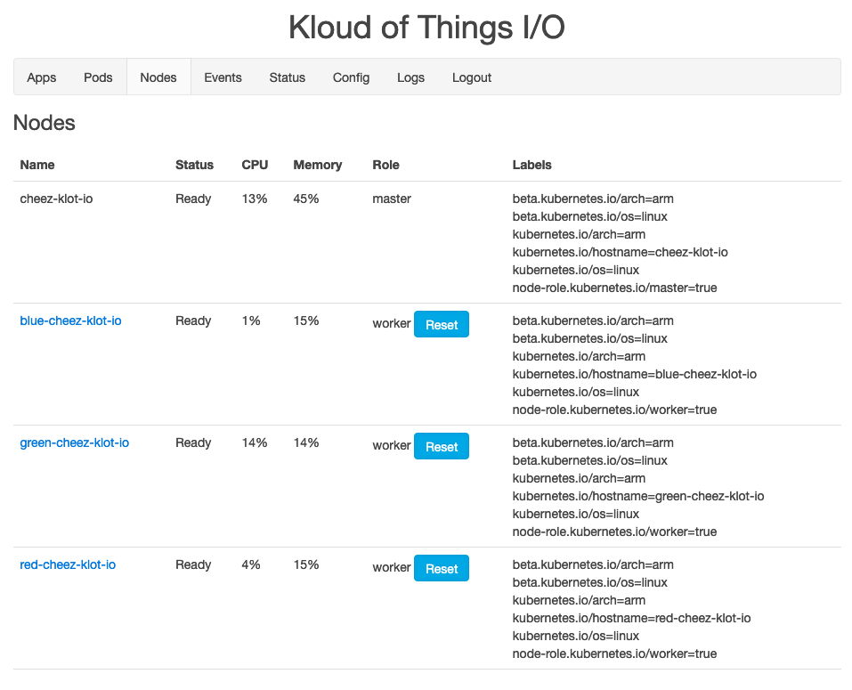

# Install klot.io on Raspberry Pi's

During installation, a lot of services and devices need to initialize and connect. Your network state will eventually be consistent. So, if something doesn't work, wait a few minutes and try again.

(I'll be working on smoothing everything out, so expect the setup to get smoother over time.)

## Easiest setup

### Requirements

- Two or more Raspberry Pi's. Tested with [3B+](https://www.raspberrypi.org/products/raspberry-pi-3-model-b-plus/) Pi's, but it may work on other models.
  - If you want to do more stuff, use 3 or 4.
- Two or more SD cards (one per Pi).
  - I'm fond of [Samsung's EVO Select 32Gb](https://www.samsung.com/us/computing/memory-storage/memory-cards/microsdhc-evo-select-memory-card-w--adapter-32gb--2017-model--mb-me32ga-am/) cards but use whatever you like. I'm not an expert in which cards perform best.
- A local computer from which you can burn SD cards, access websites, and manage your local network.
- An ethernet connection available for connecting your Raspberry Pi's to your local network.
  - The ethernet connection is for setup only.
  - Connecting one Pi at a time is fine.
- Your local network has DHCP and you plan to use it.
- (Optional) You know how to reserve IP addresses on your network.

### Burn klot.io to SD cards

1. On your local workstation, download [pi-0.3.img.zip](https://klot-io.sfo2.cdn.digitaloceanspaces.com/pi-0.3.img.zip).
2. Burn this image to each of your SD cards.

### Add Raspberry Pi master node to your network

1. Insert an SD card into a Pi.
2. Wire to your network (ethernet cable).
3. Power up.
4. Wait a few minutes or so as the Pi's OS expands the klot.io filesystem.
5. Get impatient and go to [http://klot-io.local/](http://klot-io.local/) anyway, understanding that it might not come up right away or might be persnickety.

   
6. Log in with the password 'kloudofthings'. This logs you in to your new Pi master node.

### Configure master

Use this admin page to configure several settings. When you're done, it should look similar to the following image.



- **password**: Set a new password that's at least 8 characters. This password will set access for both the GUI/API you're using and the pi account on the Pi.
- **ssh**: Decide whether to enable SSH or leave it disabled.  It's up to you, and you can change later by accessing this admin page again.
- **interface**: Choose wired or wireless for your local network.
- **country**: If using wireless, your WiFi's country.
- **ssid**: If using wireless, your WiFi network's name.
- **psk**: If using wireless, your WiFi's password.
- **role**: Use 'master' for this first one.
- **cluster**: Give your cluster a name, lowercase, no spaces. (I should have something check that and password too). This will be prepended to the name of the admin page going forward, too.

1. Click **Configure**. The admin page's URL changes to <cluster>-klot-io.local.
2. When prompted, log in with your new password.
3. Wait for **Status - Initializing** at the top of the page to change to **Status - Master**. This'll take several minutes; might want to get a sandwich.



To access the admin page from now on, use <cluster>-klot-io.local. This is the hostname of the master node. This page is your home base for the Kubernetes cluster.

Note: You might want to go to your router and reserve the IP address for the master node. This will prevent the IP from changing. Mine doesn't seem to need it but I don't know every router.

### Join workers

0. Wait for **Status - Master** on your admin page at <cluster>-klot-io.local.
1. Plug another SD card with the klot.io image into another Pi.
2. Wire to your network (ethernet cable). If your master node is set to use WiFi, it's okay to unplug the master Pi from the ethernet first.
3. Power up.
4. From <cluster>-klot-io.local, select the **Nodes** tab.
5. Wait for a node called 'klot-io' to appear.  That's your new node.

   
6. Wait for your master node to have the status 'Ready'. Not sure why that status and the other aren't in sync. You'll want to wait a few minutes as the hard drive reconfigures and the Pi reboots; it'll be be persnickety otherwise.
7. Choose how you want to configure the worker node.
   7a. To have it join as a worker with the same settings as the master, give it a name and click **Join**.
   7b. Or, to have it join as a worker with different settings, click its name. This opens a new Config page on its own site. Refer to the previous section for an explanation of each field.
8. On the master node's admin page, wait 20 seconds or so. The new worker node will appear on the **Nodes** tab as (name)-<cluster>-klot-io.local.
9. If you've switched from wired to wireless, the new node may hang as 'NotReady'.  Give it a minute and then power cycle the worker.
10. Repeat these steps for as many workers as you want. Do one at a time. Make sure each name is unique (ya, I should probably write something to check this too).

When you're done, your master and worker nodes will all appear on the **Nodes** tab with the 'Ready' status.



Congrats!  You have a Kubernetes cluster running on your Raspberry Pi's!

Next steps: Hit up [Apps](Apps.md) for what's next.

To see what this system can do, check out [GUI](GUI.md).

## More secure setup

This is a little more involved but more secure.

Note: The more secure setup works on Mac only for now. Happy to do Windows and Linux (which might already work as is?) when I have the chance.

### Requirements

Same as above:

- Two or more Raspberry Pi's. Tested with [3B+](https://www.raspberrypi.org/products/raspberry-pi-3-model-b-plus/) Pi's, but it may work on other models.
  - If you want to do more stuff, use 3 or 4.
- Two or more SD cards (one per Pi).
  - I'm fond of [Samsung's EVO Select 32Gb](https://www.samsung.com/us/computing/memory-storage/memory-cards/microsdhc-evo-select-memory-card-w--adapter-32gb--2017-model--mb-me32ga-am/) cards but use whatever you like. I'm not an expert in which cards perform best.
- A local computer from which you can burn SD cards, access websites, and manage your local network.
- An ethernet connection available for connecting your Raspberry Pi's to your local network.
  - The ethernet connection is for setup only.
  - Connecting one Pi at a time is fine.
- Your local network has DHCP and you plan to use it.
- (Optional) You know how to reserve IP addresses on your network.

New requirements:

- docker installed on your workstation.
- docker-compose installed on your workstation.
- You know your way around Docker and a command line in general.

### Burn klot.io and Docker to SD cards

Basically, you can run the Docker GUI locally and burn your settings right onto the cards before putting them into the Pi's.

1. On your local workstation, download [pi-0.3.img.zip](https://klot-io.sfo2.cdn.digitaloceanspaces.com/pi-0.3.img.zip).
2. Burn this image to each of your SD cards.
3. Pop the SD card out after burning and pop it back in.
4. Enable the cross compiler with `make cross`. This allows ARM (Raspberry Pi processor) images to run on Docker.
5. Type `make config` in this repo and go to http://127.0.0.1:8084 when docker compose is up.
6. Configure the first SD card as the master.
7. Press `Ctrl-C` to exit.
8. Run `make clean` to ensure there are no residual Docker images running.
9. Repeat for each worker SD card. Make sure you eject each SD from the Mac.
10. Put the cards in the Pi's and boot up.
11. After a few minutes, go to http://<cluster>-klot-io.local where <cluster> is the cluster you configured.

Check out [Apps](Apps.md) and [GUI](GUI.md) for more.

## H@X0rs ONLY setup


The config files to set up the Pi's are basic YAML. Normally they're in the `/opt/klot-io/config/` directory, but if you put files in the `/boot/klot-io/config/` directory, the Pi's will automatically copy and implement them.

That's all the above process is doing. It's mounting the `/boot/klot-io/config/` inside the API container as `/opt/klot-io/config/`. So when it saves the config to `/opt/klot-io/config/` it ends up on `/boot/klot-io/config/`, which is copied over when the Pi starts up.

Here's the different files:

`account.yaml` - Controls the Pi and GUI/API account

```yaml
password: # used for the Pi user account and GUI/API login
ssh:      # enabled|disabled
```

`network.yaml` - Controls the Pi's network connection for Kubernetes

```yaml
interface: # eth0 - wired | wlan0 - wireless
country:   # country code for wireless settings, eg. US
ssid:      # WiFi SSID to connect to
psk:       # WiFi password to connect with (leave blank for none)
```

`kubernetes.yaml` - Controls the Pi's role in Kubernetes

```yaml
role:      # master|worker|reset - completely resets Kubernetes via kubeadm reset
cluster:   # name of the cluster
name:      # name of the node (worker only)
```

1. On your local workstation, download [pi-0.3.img.zip](https://klot-io.sfo2.cdn.digitaloceanspaces.com/pi-0.3.img.zip).
2. Burn this image to each of your SD cards.
3. Pop the SD card out after burning and pop it back in.
4. Create the three YAML files shown above in `/Volumes/boot/klot-io/config`.
   - Make sure you use the same password for each.
   - The Kubernetes token the workers use for joining is derived from this password.
5. Repeat for each Pi. Most likely, the `account.yaml` and `network.yaml` files will be identical for each Pi. The `kubernetes.yaml` files will be slightly different for each Pi.
   - Have one and only one node with the 'role' set to 'master'.
   - 'cluster' name needs to be the same on each node.
   - Worker 'name' names each need to be different.

## SSD setup

This is how to boot off of an SSD hard drive for installation. I put this here because I'll forget otherwise.

### Requirements

- A hard drive like [this](https://www.amazon.com/gp/product/B073H552FK/ref=ppx_yo_dt_b_search_asin_title?ie=UTF8&psc=1).

### Burn klot.io to SSD

1. On your local workstation, download [pi-0.3.img.zip](https://klot-io.sfo2.cdn.digitaloceanspaces.com/pi-0.3.img.zip).
2. Burn this image to each of your SSD.
3. (Optional - set kubernetes to 'reset' for now, just safer) `make config`.
4. Boot the Pi with the SSD attached (no SD card).
5. `sudo lsblk` to determine the partition (usually sda).
6. `sudo fdisk /dev/sda` to repartition.
7. `p` to copy start of sda2.
8. `d` and accept default to delete the 2 partition (it's ok).
9. `n` new primary (default), `2` (default) paste the start, and all the way to the end (default), `n` to not remove signature.
10. `w` to write.
11. `sudo shutdown -r now` to reboot.
12. `sudo resize2fs /dev/sda2` to resize. (takes a bit btw)
13. Now have it join the cluster through the Master's GUI
